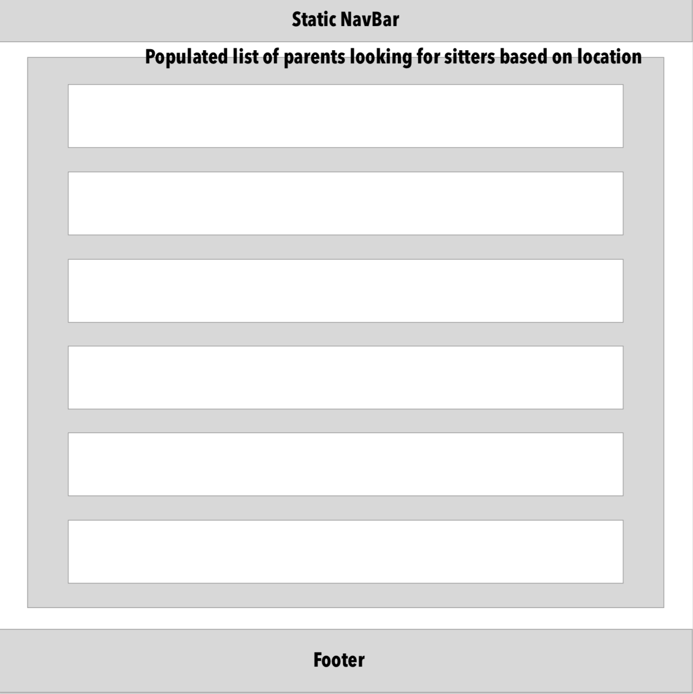
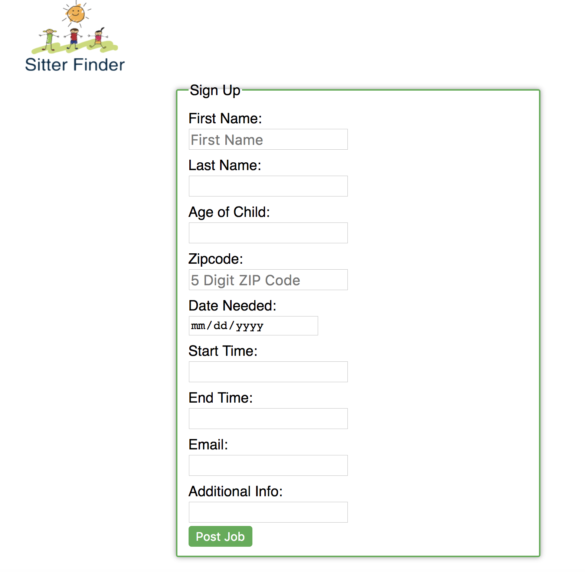
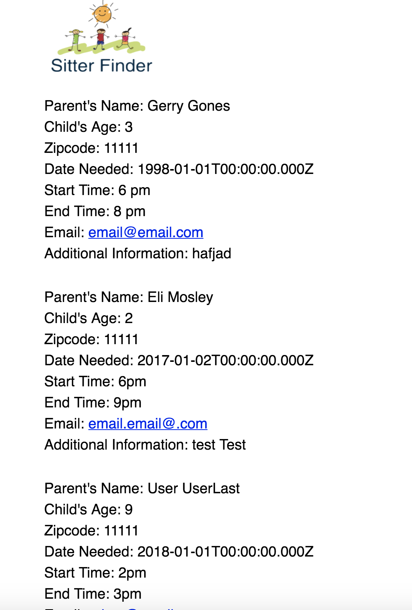

# <a href="https://sitter-finder.netlify.com/">Sitter Finder</a>

#

Sitter Finder's mission is to make child care more affordable and accessible to parents. The technology we're building simplifies the process of finding a baby sitter for a special occasion or if needed on a regular schedule. The technology will also allow parents to search for certified sitters based on location.

#

# Features:

- Parents can fill out a form to request a babysitter for a specific date.
- Sitters can search for potential jobs based on zip code.
- Sitters can contact parents using email attached to babysitting job posting.
- Parents job postings include contact email, contact name, zip code, age of child, date babysitter is needed for, start time, end time, as well as a section for any additional information such as allergies, animals in the home, etc.

#

# Wireframe:

# Homepage

# Parents Info Form

# List of local families after searching

#

# Screenshots of Live Site:

# Homepage

# Parents Info Form

# List of local families after searching

## Collaborators
<a href="https://github.com/F-Adam-B">@F-Adam-B</a>, <a href="https://github.com/nateusmc">@nateusmc</a>
